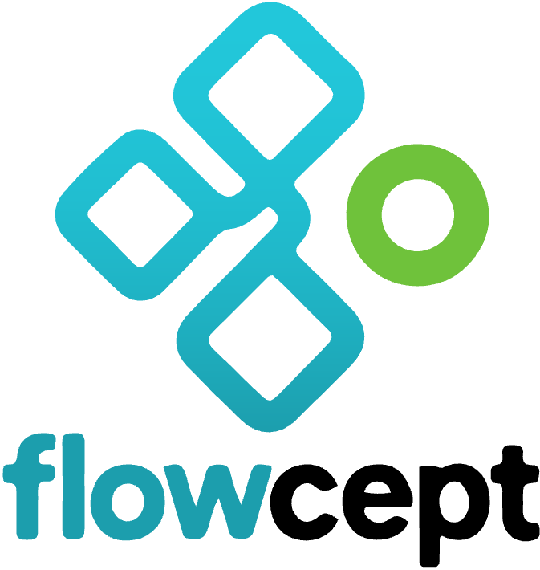

<p align="center">
  <picture>
    <source srcset="./docs/img/flowcept-logo-dark.png" media="(prefers-color-scheme: dark)" />
    <source srcset="./docs/img/flowcept-logo.png" media="(prefers-color-scheme: light)" />
    
  </picture>
</p>

<h3 align="center">Runtime provenance for distributed scientific and AI workflows</h3>

<p align="center">
Capture, stream, query, visualize, and reason over workflow lineage across ML, agentic, edge, cloud, and HPC systems.
</p>

<p align="center">
  <a href="https://flowcept.org">Website</a> ·
  <a href="https://flowcept.readthedocs.io/">Documentation</a> ·
  <a href="./examples">Examples</a> ·
  <a href="./notebooks">Notebooks</a> ·
  <a href="https://flowcept.readthedocs.io/en/latest/publications.html">Publications</a>
</p>


<p align="center">

  <a href="https://flowcept.readthedocs.io/">
    
  </a>

  <a href="https://pypi.org/project/flowcept">
    
  </a>

  <a href="https://github.com/ORNL/flowcept/actions/workflows/run-tests.yml">
    
  </a>

  <a href="https://github.com/ORNL/flowcept/actions/workflows/checks.yml">
    
  </a>

  <a href="LICENSE">
    
  </a>

</p>


## What Is Flowcept?

Flowcept is a lightweight runtime provenance data management and data observability system for AI, scientific, and agentic workflows.
It records what ran, what data were used and generated, where it ran, how long it took,
which resources it consumed, and how workflow artifacts relate to each other, with rich context and detailed metadata.

It is designed for workflows that are distributed, heterogeneous, and hard to inspect after the fact:
ML training, agentic workflows, HPC jobs, edge-to-cloud-to-HPC pipelines, Workflow Management System tasks, and multi-workflow campaigns.

Flowcept records can start as simple JSONL files for small local demos, move to LMDB for
pure file-based runs, and scale to MongoDB for cloud deployments, production-style querying, dashboards, and UI use.
For distributed runs, provenance records can also stream through a message queue while the
workflow is still executing. The Flowcept Agent adds LLM-based interaction on top of captured
provenance, so users can ask questions, inspect lineage, and drive visual exploration naturally, both to the in-motion data in the MQ systems or the data persisted in the database. 

## See It In Action

The Flowcept UI turns captured provenance into browsable workflow structure, data lineage,
dashboards, workflow cards, and natural-language provenance exploration.


## Why Flowcept?

- **Distributed by design**: MQ-based provenance streaming with [Redis](https://redis.io) (default), [RabbitMQ](https://www.rabbitmq.com), [Kafka](https://kafka.apache.org), and [Mofka](https://mofka.readthedocs.io), plus database-backed storage for online querying.
- **Low-overhead HPC capture**: buffer and stream provenance with low interference in large-scale jobs.
- **Plugin-friendly capture**: instrument native code or use adapters, including PyTorch, Dask, MLflow, TensorBoard, and more.
- **AI/ML-ready semantics**: preserve workflow, task, parameter, metric, model, tensor, artifact, telemetry, and resource-usage context.
- **Agentic workflow lineage**: capture agent/tool execution, LLM usage, prompts, responses, and runtime provenance.
- **Flowcept Agent**: chat naturally with captured provenance, inspect workflow data, generate workflow cards, and drive interactive visualizations.
- **Standards-aware provenance**: Flowcept follows the [W3C PROV](https://www.w3.org/TR/prov-overview/) model and extends it for workflow, ML, and agentic execution contexts.

## Quickstart (get it up in 1 minute): Capture Provenance Offline

This minimal example needs no database, broker, or external service.

```bash
pip install flowcept
```

Create `quickstart.py`:

```python
from flowcept import Flowcept, flowcept_task
from flowcept.instrumentation.flowcept_decorator import flowcept


@flowcept_task(output_names="y")
def add_one(x):
    return x + 1


@flowcept_task(output_names="z")
def double(y):
    return y * 2


@flowcept
def main():
    y = add_one(3)
    z = double(y)
    print("result:", z)


if __name__ == "__main__":
    main()
    # print(Flowcept.read_buffer_file())  # inspect raw JSONL records if needed
    Flowcept.generate_report(print_markdown=True)
```

Run it:

```bash
python quickstart.py
```

Flowcept captures task inputs, outputs, timing, workflow structure, and writes a local JSONL buffer.
The final line reads the default buffer file and prints a workflow card.

For the maintained tutorial, read the [Quick Start](https://flowcept.readthedocs.io/en/latest/quick_start.html).

## Use The Web UI

For interactive and live provenance exploration, run Flowcept with MongoDB and the webservice.
The UI shows captured workflows, so run one or more workflows after the service is up to populate the database.

```bash
pip install "flowcept[webservice,mongo]"
make services-mongo
flowcept --init-settings --full -y
flowcept --config-profile full-online -y
flowcept --start --ui
```

Open `http://localhost:5173`.

In another terminal, run a workflow with the same online settings, for example:

```bash
python examples/start_here.py
```

The UI provides:

- **Workflow and campaign browser** for runs, tasks, artifacts, and agents.
- **Dataflow graph** for W3C PROV-style task/data lineage.
- **Task and data inspectors** for metadata, inputs, outputs, timing, and artifact details.
- **Dashboards** for runtime summaries and workflow metrics.
- **Workflow cards** downloadable as Markdown or PDF.
- **Chat agent** for natural-language questions and interactive provenance visualization.

See the [Web UI docs](https://flowcept.readthedocs.io/en/latest/web_ui.html) and [ui/README.md](ui/README.md).

## Flowcept Agent

The Flowcept Agent lets users ask natural language questions over captured provenance instead of hand-writing queries.
It supports two complementary modes:

- **Web chat**: built into the Flowcept UI. The chat webservice route calls Flowcept's LangChain tool orchestrator and keeps answers scoped to the workflow or campaign being viewed.
- **MCP server**: exposes the same provenance tool surface to external assistants such as Codex, Claude Code, or other MCP clients.

The tool surface covers two analysis paths:

- **Streaming provenance tools** query records directly from the runtime stream. These are best for monitoring and runtime analysis while a workflow is still running.
- **Persisted provenance tools** query MongoDB or LMDB. These are best for postmortem analysis, dashboards, workflow cards, and live analysis with a small flush delay.

The Flowcept Agent itself also uses these tools through its LangChain orchestration layer.

Example questions:

- “Which activity took the longest?”
- “Show the lineage of the selected model.”
- “Which input files were larger than 100 MB?”
- “Generate a workflow card for this campaign.”
- “Highlight all tasks related to the best model.”

See the [Flowcept Agent docs](https://flowcept.readthedocs.io/en/latest/agent.html) and [src/flowcept/agents/README.md](src/flowcept/agents/README.md).

## Capture Options

Flowcept supports several capture styles. Use the least invasive one that answers your provenance questions.

| Need | Use |
|---|---|
| Minimal function-level capture | `@flowcept_task` |
| Whole workflow context | `with Flowcept():` or `@flowcept` |
| Custom metadata and manual events | `FlowceptTask` |
| Loop capture | `FlowceptLoop` |
| ML model and tensor semantics | PyTorch instrumentation |
| Tool/framework observability | Dask, MLflow, TensorBoard, MCP, and other adapters |
| Distributed runtime stream | [Redis](https://redis.io), [RabbitMQ](https://www.rabbitmq.com), [Kafka](https://kafka.apache.org), or [Mofka](https://mofka.readthedocs.io) message queues |
| Queryable persistent store | MongoDB or LMDB |

Read [Provenance Capture Methods](https://flowcept.readthedocs.io/en/latest/prov_capture.html) for examples.

## Storage And Querying

Flowcept can run fully offline or as an online distributed system.

| Mode | What happens |
|---|---|
| Offline JSONL | Provenance is captured locally and can be loaded later. |
| MQ stream | Runtime records are streamed through [Redis](https://redis.io), [RabbitMQ](https://www.rabbitmq.com), [Kafka](https://kafka.apache.org), or [Mofka](https://mofka.readthedocs.io). |
| MongoDB | Rich online queries, web UI, dashboards, workflow cards, and agent chat. |
| LMDB | Lightweight local persistence without an external database service. |

Query surfaces:

- Python API: `Flowcept.db`
- CLI: `flowcept --query ...`
- REST API: `flowcept --start --webservice`
- Web UI: browser-based exploration and dashboards
- Flowcept Agent: natural-language provenance querying and reasoning

Read [Provenance Querying](https://flowcept.readthedocs.io/en/latest/prov_query.html), [Provenance Storage](https://flowcept.readthedocs.io/en/latest/prov_storage.html), and the [REST API docs](https://flowcept.readthedocs.io/en/latest/rest_api.html).

## Workflow Cards

Flowcept generates workflow cards: structured run summaries for reproducibility, review, and communication.
Cards include workflow metadata, execution status, activity summaries, resource usage, artifacts, and lineage structure.

```python
from flowcept import Flowcept

Flowcept.generate_report(workflow_id="<workflow-id>")
Flowcept.generate_report(campaign_id="<campaign-id>")
Flowcept.generate_report(workflow_id="<workflow-id>", format="pdf")
```

The Markdown workflow cards follow the upstream
[Workflow Provenance Card template](https://github.com/data-cards/workflow-provenance-card).

Read the [Reporting docs](https://flowcept.readthedocs.io/en/latest/reporting.html).

## Installation

Install only what you need.

```bash
pip install flowcept                  # minimal package
pip install "flowcept[mongo]"         # MongoDB support
pip install "flowcept[webservice]"    # REST API and web UI
pip install "flowcept[dask]"          # Dask adapter
pip install "flowcept[mlflow]"        # MLflow adapter
pip install "flowcept[rabbitmq]"      # RabbitMQ MQ
pip install "flowcept[kafka]"         # Kafka MQ
pip install "flowcept[telemetry]"     # CPU/memory telemetry
pip install "flowcept[lmdb]"          # LMDB storage
pip install "flowcept[llm_agent]"     # Flowcept Agent / MCP / chat dependencies
```

`flowcept[all]` exists for development and broad testing, but it is usually better to install targeted extras.

Read [Setup and Installation](https://flowcept.readthedocs.io/en/latest/setup.html).

## Settings

Flowcept is configured through `settings.yaml`, with environment variables taking precedence.

```bash
flowcept --init-settings -y              # minimal settings
flowcept --init-settings --full -y       # full template
flowcept --config-profile full-online -y # online MQ + DB profile
```

Configuration precedence:

1. Environment variables.
2. `FLOWCEPT_SETTINGS_PATH`.
3. `~/.flowcept/settings.yaml`.
4. Built-in defaults.

Read the [CLI Reference](https://flowcept.readthedocs.io/en/latest/cli-reference.html).

## Examples And Notebooks

- [examples](examples): runnable scripts for decorators, Dask, MLflow, TensorBoard, PyTorch, agents, consumers, and object storage.
- [notebooks](notebooks): exploratory examples and tutorials.
- [Default User Guide](https://flowcept.readthedocs.io/en/latest/default_user_guide.html): recommended end-to-end guide.

## For Code Assistants

Code assistants should read [AGENTS.md](AGENTS.md) first.
It is the single source of truth for repository-specific engineering rules.

For Flowcept feature usage, read the maintained RST docs under [docs](docs) instead of inventing behavior from source snippets.

## Cite Flowcept

If you use Flowcept in research, please cite:

```bibtex
@inproceedings{souza2023towards,
  author = {Souza, Renan and Skluzacek, Tyler J and Wilkinson, Sean R and Ziatdinov, Maxim and da Silva, Rafael Ferreira},
  booktitle = {IEEE International Conference on e-Science},
  doi = {10.1109/e-Science58273.2023.10254822},
  link = {https://doi.org/10.1109/e-Science58273.2023.10254822},
  pdf = {https://arxiv.org/pdf/2308.09004.pdf},
  title = {Towards Lightweight Data Integration using Multi-workflow Provenance and Data Observability},
  year = {2023}
}
```

More publications are listed in the [Flowcept publications page](https://flowcept.readthedocs.io/en/latest/publications.html).

## Community And Contributing

Flowcept is research software developed for distributed scientific workflows.
Issues, discussions, examples, adapters, and documentation improvements are welcome.

- [Contributing guide](CONTRIBUTING.md)
- [GitHub issues](https://github.com/ORNL/flowcept/issues/new)
- [GitHub discussions](https://github.com/ORNL/flowcept/discussions/new/choose)
- [Slack channel](https://workflowscommunity.slack.com/archives/C06L5GYJKQS)

## Acknowledgement

This research uses resources of the Oak Ridge Leadership Computing Facility at Oak Ridge National Laboratory,
which is supported by the Office of Science of the U.S. Department of Energy under Contract No. DE-AC05-00OR22725.
